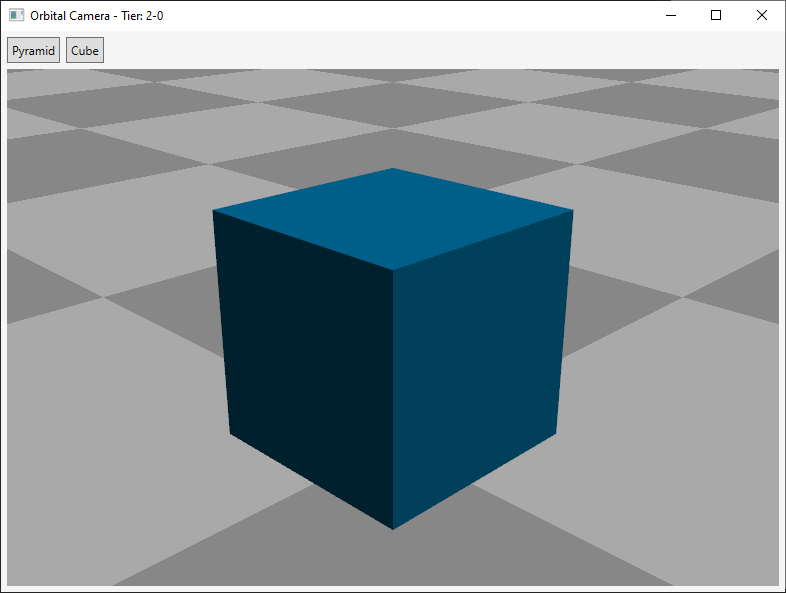

# Overview

This project is a showcase for the `OrbitalCameraController` class.

## Build and run

You can either:
- Open the solution with Visual Studio 2019 Community edition and run it.
- Execute `dotnet run` in the directory containing the `.csproj` file.

## Notes

The controller implements camera movements that revolve around a target point. It relays on WPF data structures (`Vector3D`, `Matrix3D`, etc...) and perspective camera, but those parts should easily be adjusted for another rendering system.

The controller also handles mouse events itself, but this can also be extracted and abstracted away easily if necessary.

This project's goal is just to provide a visual support for the camera controller, therefore is not constructed on the MVVM pattern but on more classic code-behind approach.

The project file makes use of .NET Core 3.0. It should be migrated to .NET 5 once released.

## How to use

- Left click to rotate
- Middle click to pan
- Right click to zoom

Click on Pyramid or Cube buttons to change the rendered mesh.
